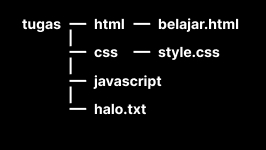

# Writing & Presentation Test
### Muh Zaki Choiruddin 
### Backend Web Development Track | Skilvul Tech4Impact

Assalamu'alaikum Wr. Wb. Di markdown ini saya akan menjelaskan berbagai materi yang telah saya pelajari selama mengikuti kegiatan `Kampus Merdeka Skilvul Tech4Impact pada track Backend Web Development`.

## Table of Contents
- [Unix Command Line](#unix-command-line)
- [HTML](#html)
- [CSS](#css)
- [JavaScript Dasar](#javascript)
- [Algorithm & Data Structures](#algorithm-&-data-structures)
- [Git & Github Dasar](#git-&-github-dasar)

## Unix Command Line
### Pengertian
Command Line adalah `shell yang berbasis text`, sedangkan shell adalah sebuah program yang berfungsi sebagai alat komunikasi dengan sistem operasi. Shell terdapat 2 jenis:
- CLI => Shell yang berbasis command line, contoh: sh, bash, zsh, cmd
- GUI => Shell yang berbasis graphical (atau terdapat tampilannya), contoh: Windows, Mac OS, Linux

### Perintah
Command line (CLI) dapat diakses menggunakan terminal.
```sh
cd tugas
touch pertemuan1.txt
nano pertemuan1.txt
rm pertemuan1.txt
```
| Perintah | Fungsi                                      |
| -------- | ------------------------------------------- |
| cd       | Berpindah direktori                         |
| ls       | Melihat isi sebuah direktori                |
| cp       | Untuk menyalin sebuah file                  |
| mv       | Untuk memindahkan file, mengganti nama file |
| cat      | Menampilkan isi file                        |
| mkdir    | Membuat sebuah direktori                    |
| rmdir    | Menghapus direktori                         |
| pwd      | Melihat current working directory           |

### File System Structure (Praktek)
Membuat folder tugas yang berisi file halo.txt dan berisi folder html, css, javascript. Di dalam folder html terdapat file belajar.html, di dalam folder css terdapat file style.css.


```sh
mkdir tugas
cd tugas
touch halo.txt
mkdir html
mkdir css
mkdir javacript
cd html
touch belajar.html
cd ../css
touch style.css
```

## HTML
### Pengertian
HTML (Hypertext Markup Language) adalah sebuah bahasa markup yang digunakan sebagai `kerangka dasar website`. Web browser seperti Chrome, Firefox, Edge, Safari, atau Opera akan membaca dokumen HTML. Dokumen HTML yang berisi tag-tag HTML akan memberitahu browser bagaimana cara menampilkan sebuah konten.

### Tag
Tag merupakan sebuah elemen di dalam HTML yang berfungsi untuk menampilkan sesuatu. Contoh:
#### Paragraf
Paragraf dapat dibuat menggunakan tag `<p></p>`.
```sh
<p>Selamat Datang!</p>
<p>Muh Zaki Choiruddin</p>
```
#### Heading
Heading merupakan teks yang berukuran besar dapat dibuat dengan tag `<h1></h1>`. 
Angka dapat diganti hingga 6, semakin besar angka maka semakin kecil ukuran heading.
```sh
<h1>Intro</h1>
<h2>Data diri</h2>
```
#### Image
Untuk memasukkan gambar ke dalam HTML kita dapat menggunakan tag `` yang diikuti dengan attribute src yang mengarah ke lokasi direktori gambar.
```sh

```

#### List
List memiliki 2 tipe, yakni ordered list dan unordered list.
Ordered list dibuat menggunakan tag `<ol></ol>`
Sedangkan Unordered list dibuat menggunakan tag `<ul></ul>`
Lalu untuk item list dibuat menggunakan tag `<li></li>`
```sh
<h1>Ordered List</h1>
<ol>
    <li>Belok ke arah selatan</li>
    <li>Lurus sejauh 2 km</li>
    <li>belok kiri sebelum pertigaan</li>
</ol>

<h1>Unordered List</h1>
<ul>
    <li>Baju</li>
    <li>Topi</li>
    <li>Jaket</li>
    <li>Laptop</li>
</ul>
```

#### Table
Untuk membuat table di dalam HTML dapat menggunakan tag `<table>`
Di dalam tag `<table>` kita memerlukan tag `<tr>` yakni Table Row
Di dalam tag `<tr>` terdapat tag `<td>` yakni Table Data
```sh
<table>
    <tr>
        <td>Nama</td>
        <td>Alamat</td>
        <td>Perusahaan</td>
    </tr>
    <tr>
        <td>Muh Zaki Choiruddin</td>
        <td>Klaten</td>
        <td>OSORA</td>
    </tr>
</table>
```

## B. CSS
### Pengertian
CSS (Cascading Style Sheet) digunakan untuk `menghias tampilan website`. Cara kerjanya adalah apabila dokumen HTML yang dibaca oleh browser terdapat konten CSS maka browser akan memproses CSS tersebut dan menampilkan design sesuai dengan apa yang telah ditentukan.

CSS dapat disisipkan dengan 3 cara, yakni:
1. Inline CSS
Langsung dimasukkan ke dalam tag HTML.
```sh

```
2. Internal CSS
Membuat sebuah tag <style></style> di dalam tag head HTML.
```sh
<head>
    <style>
        .......
    </>
</head>
```

3. External CSS
Memisahkan file HTML dan file CSS.

### Struktur CSS
CSS terdiri dari 3 struktur utama yakni:
1. Selector
Selektor adalah kata kunci untuk memilih elemen HTML yang akan kita beri style.

2. Property
Properti adalah sekumpulan aturan yang akan diberikan kepada elemen yang dipilih.

3. Value
Nilai untuk sebuah property CSS.

### Cara Styling HTML
Ada beberapa cara yang dapat kita lakukan untuk melakukan styling sebuah element HTML, contoh:
1. Mengakses attribute `id` HTML
index.html
```sh
<h1 id="judul"></h1>
```
```sh
#judul {
    color: red;
    font-size: 30px
}
```
2. Mengakses attribute `class` HTML
index.html
```sh
<h1 id="judul" class="namaku"></h1>
```
```sh
#namaku {
    color: red;
    font-size: 30px
}
```
3. Mengakses tag HTML
index.html
```sh
<h1 id="judul" class="namaku"></h1>
```
```sh
h1 {
    color: red;
    font-size: 30px
}
```


1. External CSS
Memisahkan file HTML dan file CSS.

## Javascript
### Pengertian
Javascript merupakan salah satu bahasa pemrograman untuk membangun website. Saat ini kepopuleran javascipt sedang naik bahkan di 2022, 98% website di dunia terdapat bahasa pemrograman javascript di dalamnya.

### Tipe Data
#### String
String digunakan untuk menyimpan data bentuk `angka, tanggal, karakter`.
```sh
let data = "Namaku Zaki, umurku 20 tahun!"
```
#### Integer
Tipe data untuk menyimpan sebuah `bilangan bulat`.
```sh
let number = 30
```
#### Float
Digunakan untuk menyimpan `bilangan desimal`.
```sh
let pi = 3.14
```
#### Array
Tipe data yang digunakan untuk menyimpan `beberapa data` yang ditandai dengan nilai indeks.
```sh
let friends = ["Zaki", "Tony", "Farhan", "Tom", "Zira"]
console.log(friends[3])
// "Tom"
```

### Operator
Operator adalah simbol yang digunakan untuk melakukan `operasi pada suatu nilai dan variabel`.
#### Aritmatika
Melakukan operasi aritmatika seperti `penjumlahan, pengurangan, pembagian, perkalian`.
```sh
let year = 2020 + 2
// 2022

let score = 30 * 3
// 90
```
| Simbol | Fungsi          |
| ------ | --------------- |
| +      | Penjumlahan     |
| -      | Pengurangan     |
| *      | Perkalian       |
| **     | Pemangkatan     |
| /      | Pembagian       |
| %      | Sisa hasil bagi |

#### Perbandingan
Operator relasi atau perbandingan adalah operator yang digunakan untuk `membandingkan dua nilai`.
| Simbol      | Fungsi                  |
| ----------- | ----------------------- |
| >           | Lebih besar             |
| <           | Lebih kecil             |
| == atau === | Sama dengan             |
| != atau !== | Tidak sama dengan       |
| >=          | Lebih besar sama dengan |
| <=          | Lebih kecil sama dengan |

### Percabangan
Digunakan untuk membuat alur program yang bercabang, biasanya dikenal dengan istilah `jika.. maka...`.

#### If else
```sh
const money = 20000
const price = 15000

if (money > price) {
    console.log("Uang kamu cukup untuk membeli barang ini.");
} else {
    console.log("Maaf, uang kamu tidak cukup.");
}
```

Atau juga bisa diberi kondisional tambahan menggunakan else if.
```sh
const grade = "B"

if (grade === "A") {
    console.log("Kamu mendapat predikat sangat baik.");
} else if (grade === "B") {
    console.log("Kamu mendapat predikat baik.");
} else if (grade === "C") {
    console.log("Kamu mendapat predikat cukup.");
} else {
    console.log("Maaf kamu tidak lulus.");
}
```

#### Switch case
```sh
const day = "Wednesday"

switch (day) {
    case "Monday":
        console.log("Aku akan memakai baju biru")
        break:
    case "Tuesday":
        console.log("Aku akan topi terbalik")
        break:
    case "Wednesday":
        console.log("Aku akan ke Silicon Valley")
        break:
    case "Thursday":
        console.log("Tidur seharian dirumah")
        break:
    case "Friday":
        console.log("Aku akan membeli stok makanan")
        break:
    default:
        console.log("Aku akan main")
}
```

### Perulangan
Metode dalam pemrograman untuk mengeksekusi suatu perintah yang sama `secara terus-menerus`. Perulangan ada 2 jenis yakni:
- Counted Loop merupakan perulangan yang jelas dan sudah tentu berapa banyak perulangannya.
- Uncounted Loop, merupakan perulangan yang tidak jelas berapa kali ia harus mengulang.

#### For
For termasuk perulangan jenis counted loop karena sudah diketahui berapa banyak program akan diulang.
```sh
for(let i = 0; i < 10; i++){
    console.log("perulangan ke " + i)
}
```

#### While
While termasuk perulangan jenis uncounted loop karena tidak diketahui berapa banyak program akan diulang.
```sh
let ulangi = confirm("Apakah anda mau mengulang?");
let counter = 0;

while(ulangi){
    let jawab = confirm("Apakah anda mau mengulang?")
    counter++;
    if(jawab == false){
        ulangi = false;
    }
}
```

#### Do While
Mengeksekusi pernyataan tertentu hingga kondisi pengujian bernilai false. Kondisi dievaluasi setelah mengeksekusi pernyataan.
```sh
let ulangi = confirm("Apakah anda mau mengulang?");;
let counter = 0;

do {
    counter++;
    ulangi = confirm("Apakah anda mau mengulang?");
} while(ulangi)
```


## Algorithm & Data Structures
### Pengertian
Algoritma adalah sekumpulan instruksi atau langkah-langkah yang dituliskan secara sistematis dan digunakan untuk menyelesaikan masalah.

### Apa Pentingnya?
Basic dari programming adalah penyelesaian permasalahan. Algoritma menjadi kunci penting agar developer dapat menciptakan solusi melalui code untuk menyelesaikan sebuah permasalahan. Sedangkan bahasa pemrograman, framework, tools yang lain hanyalah tambahan saja. Algoritma mengajarkan kita cara berpikir terstruktur.

### Ciri-ciri
| Simbol        | Fungsi                    |
| ------------- | ------------------------- |
| Input         | Memiliki 0 atau lebih     |
| Output        | Memiliki minimal 1        |
| Definiteness  | Instruksi tidak ambigu    |
| Finiteness    | Memiliki titik berhenti   |
| Effectiveness | Tepat sasaran dan efisien |

### Jenis Proses
| Simbol     | Fungsi                                |
| ---------- | ------------------------------------- |
| Sequence   | Instruksi dijalankan secara berurutan |
| Selection  | Dijalankan jika memenuhi kondisi      |
| Iteration  | Dijalankan selama memenuhi kondisi    |
| Concurrent | Dijalankan secara bersamaan           |

### Penyajian
1. Deskriptif
Ditulis seperti menulis tutorial.
```sh
Menyalakan laptop
1. Siapkan laptop
2. Tekan tombol power
3. Tunggu laptop selama booting
4. Apabila sudah masuk ke desktop berarti laptop berhasil dinyalakan
```

2. Flowchart
Penyajian dengan bentuk visual yang menggunakan bangun datar.

3. Pseudocode
Penulisan algoritma yag hampir menyerupai penulisan pada kode pemrograman.


## Git & Github Dasar
### Pengertian
Git merupakan tool open source sebagai `Version Control System` code. Git berfungsi untuk melacak perubahan setiap file dalam project, biasanya digunakan untuk mengelola code agar lebih rapi.

Github adalah layanan cloud yang berfungsi untuk `menyimpan code`. Dengan menggunakan github para programmer dapat berkolaborasi untuk mengerjakan suatu project dengan mudah.

### Alur kerja
1. Menginisialisasi project dengan git.
2. Menulis code program.
3. Masukkan perubahan ke staging area git.
4. Beri pesan untuk menandai perubahan.
5. Kirim code ke cloud repository.

### Praktek
#### Local
1. Buat folder project bernama `hello-git`.
2. Inisialisasi git.
```sh
git init .
```
3. Buat file baru, lalu tulis code.
```sh
<p>Hello GIT</p>
```
4. Ketik `git status` untuk melihat apakah ada perubahan di dalam project.
```sh
git status
```
5. Ketik `git add` untuk memasukkan perubahan ke staging area. Simbol titik (.) berarti memilih semua file.
```sh
git add .
```
5. Simpan perubahan di local secara permanen dengan perintah `git commit -m "isi pesan"`
```sh
git commit -m "fitur 1"
```

#### Cloud repository
1. Buat repository baru di github.com
2. Buat branch bernama `main` di local
```sh
git branch -M main
```
3. Selanjutnya tambahkan remote repository.
```sh
git remote add origin https://github.com/zakihaha/hello-git.git
```
4. Langkah terakhir adalah mengirim perubahan ke remote repository
```sh
git push -u origin main
```

| Perintah     | Fungsi                                                |
| ------------ | ----------------------------------------------------- |
| git init     | Membuat repository local                              |
| git add .    | Memasukkan perubahan ke staging area                  |
| git commit   | Simpan perubahan di local                             |
| git status   | Menampilkan daftar file yang berubah                  |
| git push     | Mengirim perubahan ke remote repository               |
| git checkout | Berpindah branch                                      |
| git pull     | Menggabungkan perubahan di remote repository ke lokal |
| git branch   | Menggabungkan branch                                  |


